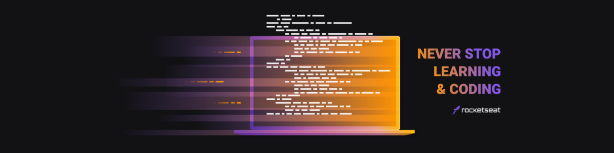

<div align="center">
    
</div>

<div align="center">
    <a href="https://github.com/Gustavo-Henrique-br" >
        
    </a>
    <a href="https://github.com/Gustavo-Henrique-br/maratonaDiscover/stargazers"></a>
</div>

<div align="center">
    <h1>👾 Maratona Discover - dev.finance$ 👾</h1>
    <p>Nesse evento da rocketseat foi nos apresentado conceitos basicos de HTML, CSS e Javascript, e eu decidi levar eles pro <em>proximo nivel</em></p>
</div>
<hr />

<div align="center">
    <h4>🚧 🚀 Em construção... 🚧</h4>
</div>

<hr />

Tabela de conteúdos
=================
<!--ts-->
   * [Features](#Features)
   * [Rodando](#Rodando)
   * [Instalação](#instalacao)
   * [Como usar](#como-usar)
      * [Site](#deploy)
      * [Pre Requisitos](#pre-requisitos)
      * [Instalando](#install)
   * [Tecnologias](#techs)
<!--te-->

<div id="Features" align="center">
    <h1>📰 Features</h1>
</div>

- [X] layout
- [X] CRUD da transação
- [X] salvar e ler dados do localStorage
- [ ] Toast (mensagens)
    - [X] criar toast
    - [ ] adicionar mais mensagens (atualmente existem: 3)
- [ ] adicionar categorias
- [ ] ordenar tabela de acordo com coluna x
- [ ] autenticação e conexão de qualquer dispositivo (usando [firebase](https://firebase.google.com/))

<div id="Rodando" align="center">
    <h1>🎲 Rodando</h1>
</div>

veja tambem o site online <a id="deploy" alt="https://maratona-discover.vercel.app/" href="https://maratona-discover.vercel.app/">Aqui</a>

<div id="pre-requisitos" align="center">
    <h4>Pré-requisitos</h4>
</div>

Antes de começar, você vai precisar ter instalado em sua máquina as seguintes ferramentas:
[Git](https://git-scm.com), [Node.js](https://nodejs.org/en/).
Além disto é bom ter um editor para trabalhar com o código, como o [VSCode](https://code.visualstudio.com/)

<div id="install" align="center">
    <h4>
        siga esses passos para instalar:
    </h4>
</div>
```bash
# clonando o projeto na sua maquina
$ git clone https://github.com/Gustavo-Henrique-br/maratonaDiscover.git

#entre na pasta do projeto
$ cd web

#instale as dependencias com:
$ yarn install
#ou
$ npm install

#iniciando o servidor
$ yarn dev
#ou
$ npm run dev

#o servidor iniciara na porta:3000
#acesse em <https://localhost:3000>
```

<div id="techs" align="center">
    <h1>🛠 Tecnologias</h1>
</div>

- [Next.js](https://nextjs.org/)
- [Styled components💅](https://styled-components.com/)
- [React](https://reactjs.org/)
    - useContext
    - useState
    - useEffect